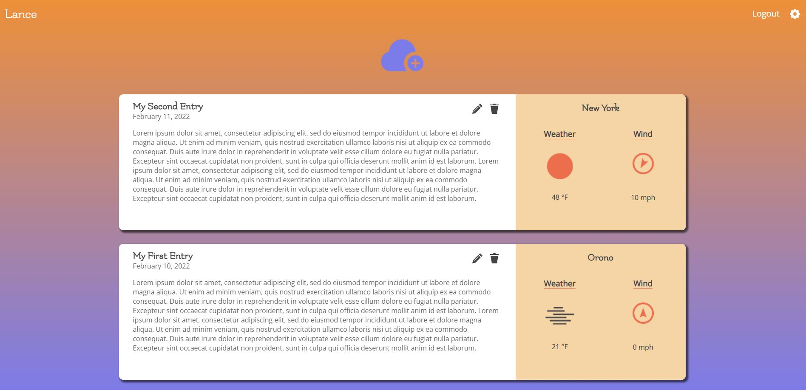

# FEND-03-WeatherJournalApp-React

A rebuilt and modified version of my first Weather Journal App.

## Table of Contents

* [Introduction](#Introduction)
* [Links](#Links)
* [Screenshot](#Screenshot)
* [Highlights](#Highlights)
* [Functions](#Functions)
* [Prerequisites](#Prerequisites)
* [Scripts](#Scripts)
* [Challenges](#Alternatives)
* [Ideas](#Ideas)
* [License](#License)
* [Acknowledgements](#Acknowledgements)

## Introduction

This application is a new rendition of my first Weather Journal App that I built for [Udacity's](https://www.udacity.com/course/front-end-web-developer-nanodegree--nd0011) Front End Developer Nanodegree. The original application was quite simple - it was built with just HTML, CSS, and JavaScript, and it had a small Express backend that stored a user's journal entries in a hash table. This new version is built with the MERN stack (MongoDB, Express, React, Node) and supports full CRUD operations.

## Links

GitHub repos:

* client - [https://github.com/LanceStasinski/FEND-03-WeatherJournalApp-React](https://github.com/LanceStasinski/FEND-03-WeatherJournalApp-React)
* server side logic - [https://github.com/LanceStasinski/Website-server/blob/main/src/controllers/weatherJournal-controller.ts](https://github.com/LanceStasinski/Website-server/blob/main/src/controllers/weatherJournal-controller.ts)

Prod deploy at [https://lancestasinski.herokuapp.com/weather-journal-app](https://lancestasinski.herokuapp.com/weather-journal-app)

## Screenshot

## Highlights

### Frontend

* Built with TypeScript and React using a scaffold generated by create-react-app
* Uses functional components, React Hooks, custom hooks, and Context
* Responsive UI built with styled-components that use Flexbox, Grid, and media queries
* Animations created with css-transition-group and CSS keyframes
* Open Sans and Flamenco fonts from the Google Fonts API
* General icons from [iconmonstr](https://iconmonstr.com/)
* Weather icons from [openWeatherMap](https://openweathermap.org/weather-conditions)
* Project structure separates pages, shared components, and styles
* Has custom form validation

### Backend

* Built with TypeScript and Express, and connects to a MongoDB database
* Server logic is run on the same server that hosts and serves my [website](https://lancestasinski.herokuapp.com)
* Queries current weather data from the [openWeatherMap](https://openweathermap.org/) API using axios
* Uses JSON web tokens to verify users making POST, DELETE, and PATCH requests
* Validates user input with express-validator and custom logic
* User passwords hashed with bcrypt
* Mongoose used to interface with the MongoDB database
* Uses a project structure that separates models, routes, middleware, and controllers

## Functions

* Generates a journal entry that contains text input by the user and weather data (sky conditions, temperature, and wind conditions) for the selected zip code
* The user can choose any valid zip code in the US to generate weather data for
* The user can choose different measurement units (imperial, metric, or standard), and thier selection will update all journal entries
* The user can create, update, and delete journal entries

## Prerequisites

This project was built on a Windows OS with the following tools installed:

* git version 2.31.1.windows.1
* yarn v1.22.10
* NodeJS v16.13.1

## Scripts

First, `cd` into the `client` directory.

* `yarn install` will install this project's dependencies
* `yarn build` will create a production build of this project
* `yarn start` will start a development server for this project

See the repo for my server for server-side scripts - [https://github.com/LanceStasinski/Website-server](https://github.com/LanceStasinski/Website-server)

## Challenges

The most challenging aspect of this project was implimenting user settings. I needed to think about how the settings could be saved both in the browser and in the database. I solved this issue by using context to store user preferences and by setting that context with values retrieved from the database upon login.

The second largest challenges was using styled-components. This was my first time using this library and it took some time to get used to compared to other CSS options. Perhaps the most challenging aspect about this was figuring out how to set prop types (to satisfy TypeScript) for the styled components. However, I found this library to ultimately be enjoyable to work with and a convenient way to style React components.

## Alternatives

Create-react-apps are powerful when it comes to building seemless SPAs, but I could have used Next.js to house the React components and the server-side logic in the same project.

## Ideas

This project could be improved in a few ways.

* Fetch the user's location and initially set their zip code with their current location
* Add unit tests
* Add a custom favicon
* Host the project indepently from my website

## License

This project is licensed under the MIT License - [https://mit-license.org/](https://mit-license.org/)

## Acknowledgments

* [styled-components](https://styled-components.com/) for their thorough documentation
* [Udacity's](https://www.udacity.com/course/front-end-web-developer-nanodegree--nd0011) front end nanodegree program for general project idea
* [iconmonstr](https://iconmonstr.com/) for making great icons free to use
